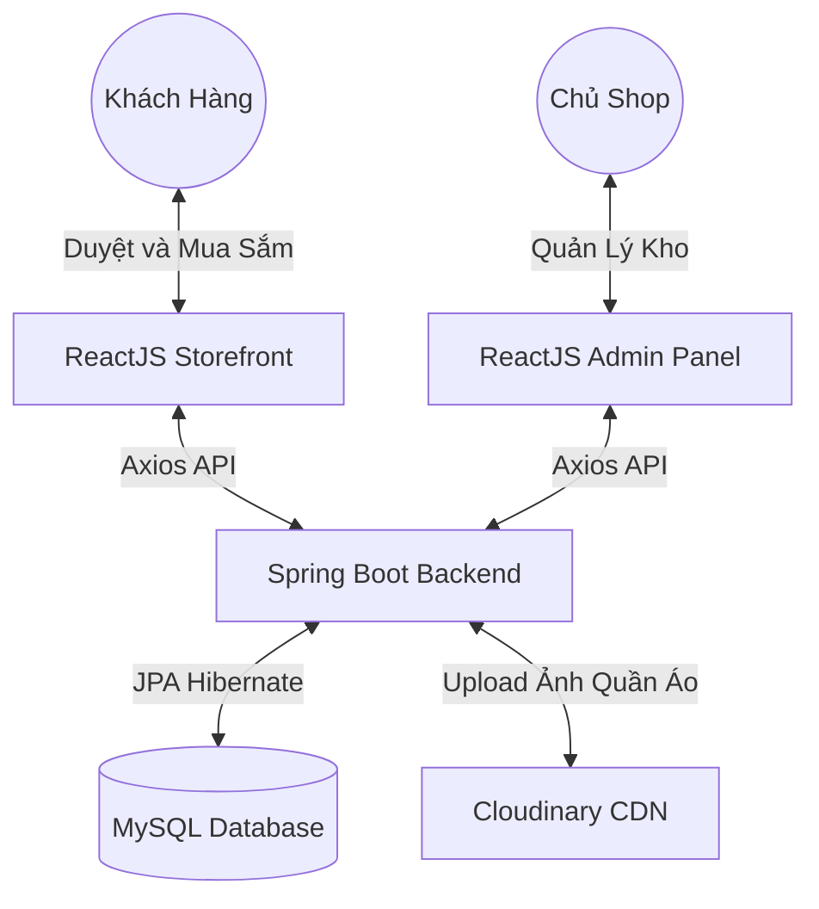

<div align="center">
  

  <h1 align="center">🛍️ FashionHub - Hệ Thống Thương Mại Điện Tử Thời Trang (Fullstack)</h1>
  
  <p align="center">
    <b>Kiến trúc mạnh mẽ với Java Spring Boot (Backend) & Giao diện tương tác mượt mà với React (Frontend)</b>
  </p>

  <!-- Badges -->
  <p align="center">
    <a href="https://spring.io/projects/spring-boot"></a>
    <a href="https://react.dev/"></a>
    <a href="https://www.java.com/"></a>
    <a href="https://www.mysql.com/"></a>
  </p>
  
  <p align="center">
    <a href="https://github.com/username/repo/stargazers"></a>
    <a href="https://github.com/username/repo/network/members"></a>
    <a href="https://github.com/username/repo/issues"></a>
    <a href="https://github.com/username/repo/blob/main/LICENSE"></a>
  </p>
</div>

<hr />

## 📖 Mục lục

<table>
  <tr>
    <td align="center"><a href="#-giới-thiệu">🌟 Giới thiệu</a></td>
    <td align="center"><a href="#-điểm-nhấn-dự-án-highlights">🔥 Điểm Nhấn</a></td>
    <td align="center"><a href="#-công-nghệ-cốt-lõi-tech-stack">💻 Công Nghệ</a></td>
    <td align="center"><a href="#-kiến-trúc-hệ-thống">📂 Kiến Trúc</a></td>
  </tr>
  <tr>
    <td align="center"><a href="#-hướng-dẫn-cài-đặt-getting-started">🚀 Cài Đặt</a></td>
    <td align="center"><a href="#-hình-ảnh-thực-tế-screenshots">📸 Hình Ảnh</a></td>
    <td align="center"><a href="#-lộ-trình-phát-triển-roadmap">🗺️ Lộ Trình</a></td>
    <td align="center"><a href="#-đóng-góp-contributing">🤝 Đóng Góp</a></td>
  </tr>
</table>

<hr />

## 🌟 Giới thiệu

**FashionHub** là một nền tảng thương mại điện tử chuyên biệt được thiết kế dành riêng cho **cửa hàng kinh doanh thời trang và quần áo**. Dự án cung cấp một quy trình mua sắm hoàn chỉnh từ khâu duyệt sản phẩm, thêm vào giỏ hàng, đến thanh toán và theo dõi đơn hàng.

> 💡 *Sứ mệnh của chúng tôi là mang đến trải nghiệm mua sắm mượt mà cho khách hàng và bộ công cụ quản lý mạnh mẽ cho chủ shop.*

<hr />

## 🔥 Điểm Nhấn Dự Án (Highlights)

| Tính Năng | Mô Tả |
| :--- | :--- |
| 👗 **Quản Lý Sản Phẩm** | Hỗ trợ phân loại theo danh mục, quản lý biến thể (màu sắc, kích cỡ, chất liệu) và tồn kho. |
| 🛒 **Giỏ Hàng & Đặt Hàng** | Luồng mua sắm tối ưu, giỏ hàng real-time, áp dụng mã giảm giá (voucher). |
| 💳 **Thanh Toán Đa Dạng** | Hỗ trợ thanh toán COD (nhận hàng trả tiền) và thanh toán trực tuyến (VNPay/Momo). |
| 📦 **Quản Lý Đơn Hàng** | Hệ thống duyệt đơn, cập nhật trạng thái giao hàng và thông báo đến khách hàng. |
| ☁️ **Lưu Trữ Hình Ảnh** | Tối ưu hóa tải ảnh sản phẩm sắc nét, tốc độ cao với Cloudinary CDN. |
| 🛡️ **Bảo Mật Tối Đa** | Xác thực người dùng bằng `JWT`, bảo vệ API an toàn tuyệt đối với Spring Security. |

<hr />

## 💻 Công Nghệ Cốt Lõi (Tech Stack)

### 🧱 Kiến Trúc Backend (Máy Chủ)
- **Framework:** `Java 17` & `Spring Boot 3.3.4` (Core, Web, Data JPA, Security)
- **Database:** `MySQL` (Quản trị dữ liệu quan hệ chặt chẽ cho E-commerce)
- **Bảo mật:** `JSON Web Tokens (JWT)`
- **Tài liệu API:** `Swagger (OpenAPI 3)`
- **Cloud & Third-party:** `Cloudinary` (Images), `Apache POI` (Xuất báo cáo doanh thu Excel)

### 🎨 Kiến Trúc Frontend (Giao Diện)
- **Framework:** `React 19.1` & `React Router DOM v7`
- **Tương tác API:** `Axios`
- **UI/UX & Styling:** `Styled-components`, `Framer Motion` (Hoạt ảnh mượt mà cho sản phẩm), `Lucide React`
- **Tiện ích:** `Recharts` (Biểu đồ doanh thu admin), `React Toastify` (Thông báo đẹp)

<hr />

## 📂 Kiến Trúc Hệ Thống

Dự án áp dụng mô hình phân tách hoàn toàn giữa Backend và Frontend nhằm tăng tính bảo mật và khả năng mở rộng khi lượng truy cập lớn.



### Tổ chức mã nguồn
```text
java-springboot-main/
├── backend/               # ⚙️ Toàn bộ logic máy chủ, API giỏ hàng, thanh toán...
│   ├── src/main/java/     # Mã nguồn Java (Controllers, Services, Repositories...)
│   ├── src/main/resources/# Cấu hình DB, cấu hình Cloudinary...
│   └── pom.xml            # Quản lý thư viện Java (Maven)
│
└── frontend-web/          # 🎨 Giao diện khách hàng và trang quản trị
    ├── public/            # File tĩnh, favicon
    ├── src/               # Mã nguồn React (Components, Pages: Cart, ProductDetail...)
    └── package.json       # Quản lý thư viện Javascript
```

<hr />

## 🚀 Hướng Dẫn Cài Đặt (Getting Started)

Chỉ mất vài phút để đưa cửa hàng thời trang này hoạt động trên máy của bạn.

### 📋 Yêu cầu môi trường
- **Java 17+** 
- **Node.js 18+** 
- **MySQL Server 8+**

### 1️⃣ Khởi động Backend (Spring Boot)
1. Clone dự án: 
   ```bash
   git clone https://github.com/username/repo.git
   ```
2. Truy cập thư mục backend: 
   ```bash
   cd java-springboot-main/backend
   ```
3. Cấu hình Database & Cloud: Mở file `src/main/resources/application.properties` và điều chỉnh:
   - *MySQL Username/Password*
   - *Cloudinary API Key* (để upload ảnh sản phẩm)
   - *JWT Secret Key*
4. Build và chạy máy chủ:
   ```bash
   ./mvnw clean install
   ./mvnw spring-boot:run
   ```
   > 🔗 Backend sẽ chạy tại: **`http://localhost:8080`** <br>
   > 📖 Khám phá API Document tại: **`http://localhost:8080/swagger-ui.html`**

### 2️⃣ Khởi động Frontend (React)
1. Mở terminal mới, truy cập thư mục frontend: 
   ```bash
   cd java-springboot-main/frontend-web
   ```
2. Cài đặt các thư viện cần thiết:
   ```bash
   npm install
   ```
3. Chạy ứng dụng web:
   ```bash
   npm start
   ```
   > 🌐 Cửa hàng sẽ hiển thị tại: **`http://localhost:3000`**

<hr />

## 📸 Hình Ảnh Thực Tế (Screenshots)

<div align="center">
  
  <br><br>
  <i>(Trang chủ cửa hàng với các bộ sưu tập thời trang mới nhất)</i>
</div>

<hr />

## 🗺️ Lộ Trình Phát Triển (Roadmap)

- [x] Thiết kế UI/UX & Dựng trang sản phẩm
- [x] Hoàn thiện hệ thống giỏ hàng và đặt đơn
- [ ] Tích hợp cổng thanh toán VNPay/Momo 💳
- [ ] Tích hợp API giao vận (Giao Hàng Nhanh / Viettel Post) 🚚
- [ ] Ứng dụng AI gợi ý phối đồ (Mix & Match) cho khách hàng 🧠
- [ ] Hệ thống đánh giá (Review) và chấm điểm sản phẩm ⭐

<hr />

## 🤝 Đóng Góp (Contributing)

Mọi đóng góp đều luôn được hoan nghênh và trân trọng! Vui lòng tuân thủ quy trình sau:
1. Fork dự án này.
2. Tạo một branch cho tính năng mới (`git checkout -b feature/NewClothingFeature`).
3. Commit các thay đổi (`git commit -m '✨ Thêm tính năng bộ lọc size quần áo'`).
4. Push lên branch (`git push origin feature/NewClothingFeature`).
5. Mở một **Pull Request** và chờ đợi review nhé!

<hr />

## 📩 Liên Hệ (Contact)

Nếu bạn có bất kỳ câu hỏi nào, đừng ngần ngại liên hệ:

- **Tên Của Bạn** - [Email: baontt2005@gmail.com](mailto:baontt2005@gmail.com)
- **Mạng xã hội:** [@YourTwitter](https://twitter.com/your_twitter) | [LinkedIn](https://linkedin.com/in/yourprofile)

<p align="center">
  
</p>
